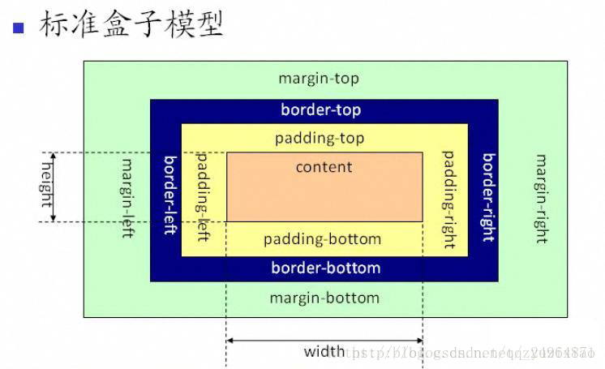
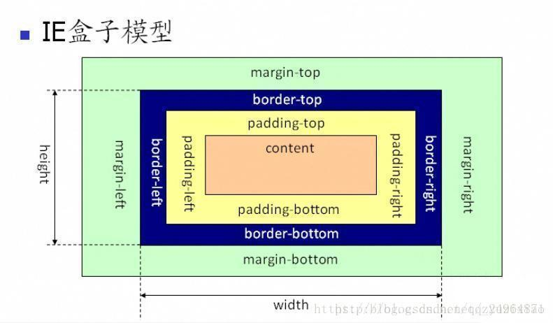
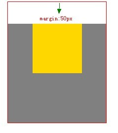

#   CSS笔记

##  CSS命名规范

### 常见元素命名
    头：                        header
    内容：                      content
    容器：                      container
    尾：                        footer
    导航：                      nav
    侧栏：                      sidebar
    栏目：                      column
    页面外围控制整体布局宽度：    wrapper
    登录条：                    loginbar
    标志：                      logo
    广告：                      banner
    页面主体：                  main
    热点：                      hot
    新闻：                      news
    下载：                      download
    子导航：                    subnav
    菜单：                      menu
    子菜单：                    submenu
    搜索：                      search
    友情链接：                  friendlink
    页脚：                      footer
    版权：                      copyright
    滚动：                      scroll
    内容：                      content
    标签页：                    tab
    文章列表：                  list
    提示信息：                  msg
    小技巧：                    tips
    栏目标题：                  title
    加入：                      joinus
    指南：                      guide
    服务：                      service
    注册：                      regesiter
    状态：                      status
    投票：                      vote
    合作伙伴：                  partner

### 页面结构命名
    容器：                      container
    页头：                      header
    内容：                      container
    页面主体：                  main
    页尾：                      footer
    导航：                      nav
    侧栏：                      sidbar
    栏目：                      column
    页面外围控制整体宽度：      wrapper
    左中右：                    left/right/center
    条：                        bar
    块：                        block

### 导航命名
    导航：                      nav
    主导航：                    mainnav
    子导航：                    subnav
    顶导航：                    topnav
    边导航：                    sidenav
    左导航：                    leftnav
    右导航：                    rightnav
    菜单：                      menu
    子菜单：                    submenu
    标题：                      title
    摘要：                      summary

### 功能命名
    标志：                      logo
    广告：                      banner
    登录：                      login
    登录条：                    loginbar
    注册：                      regesiter
    搜索：                      search
    功能区：                    shop
    标题：                      title
    加入：                      joinus
    状态：                      status
    按钮：                      btn
    滚动：                      scroll
    标签页：                    tab
    文章列表：                  list
    提示信息：                  msg
    当前的：                    current
    小技巧：                    tips
    图标：                      icon
    注释：                      note
    指南：                      guide
    服务：                      service
    热点：                      hot
    新闻：                      news
    下载：                      download
    投票：                      vote
    合作伙伴：                  partner
    友情链接：                  friendlink
    版权：                      copyright

### 颜色命名
使用颜色的名称或16进制代码，如

    .red { color: red; }
    .f60 { color: #f60; }
    .ff8600 { color: #ff8600; }

[RGB颜色对照表](http://tool.oschina.net/commons?type=3)

### 字体大小命名
直接使用"font+字体大小"作为名称,如

    .font12px {
        font-size: 12px;
    }

    .font9pt {
        font-size: 9pt;
    }

### 使用对齐目标的英文名命名

    .left {
        float: left;
    }

    .bottom {
        position: absolute;
        bottom: 0;
        left: 0;
    }

### 使用“类别+功能”的方式命名，如

    .barnews {}
    .barproduct {}

### 注意事项
1.  一律小写
2.  尽量用英文
3.  不加中杠和下划线
4.  尽量不缩写，除非一看就明白的单词

### 常用css文件含义
    主要的      master.css
    模块        module.css
    基本公用    common.css/base.css
    布局/版面   layout.css
    主题        themes.css
    专栏        columns.css
    文字        font.css
    表单        forms.css
    补丁        mend.css
    打印        print.css
    
###  参考文章

[如何规范 CSS 的命名和书写？](https://www.zhihu.com/question/19586885)


##  注释的写法
    /* Footer */

    内容区

    /* EndFooter */


##  样式

### 颜色表示法
* 英文表示法：

    ```
    red, blue, green, yellow, black, pink
    ```

* rgb表示法：

    光的三原色(red, green, blue)

        color: rgb(1,0,68)
        color: rgba(1, 0, 68, .5)
        范围：0-255(黑→白)
        
* 十六进制表示法：

        color:#010044;

    简写

        #cccccc → #ccc
        #ffffff → #fff	
        #11aa33 → #1a3

    范围： 0-9 	a-f


### 样式
    color               字体颜色
    text-align          对齐方式
    line-height         行高
    font                字体
    text-decoration     划线
    text-indent         缩进
    border              边框
    background          背景
    ws; of; tof         溢出隐藏、单行文本不换行
    opacity             透明度
    cursor              鼠标指针形状

#### text-align
文本水平对齐方向：left/center/right

#### line-height
行高(对于单行文本，行高和高度一致时，能够实现垂直居中);

#### font
* 合写：font: italic bold 40px Microsoft YaHei;

    **区分顺序，至少要有字体大小和字体系列, 且字体大小在前，字体系列在后；其余样式在这两个样式之前生效，其余样式不区分顺序**

* 分写：

    font-size   
    
    > 字体大小要用偶数，浏览器默认字体大小是16px(12px)

    font-family  
    
    > Microsoft YaHei(微软雅黑) SimSun(宋体)	默认字体 SimHei(黑体)

    font-style

    > italic 倾斜 normal 默认

    font-weight

    > font-weight: bold;  /  font-weight: (700);

    ::: tip
    文本样式都能继承，如果自己有样式，则不继承父级样式。
    :::

#### text-decoration

    overline	上划线
    line-through	中划线/删除线
    underline	下划线(a标签的默认属性)
    none		无(除a之外所有标签的默认样式)

#### text-indent

    text-indent: 2rem;

    计数单位：
            em(相对单位，em是指一个汉字的实际大小，字体大小是可以通font-size设置。)
		px(绝对单位，不受任何因素影响)

#### border
* 合写：

    border: width style color

    border: 5px solid/dotted(点划线)/dashed(虚线) black/rgb(0, 0, 0)/#000

* 分写：

    border-width    宽度

    border-style    线性    **不能省略**

    border-color    颜色

* border的四个方向：

    top/bottom/left/right

#### background
* 合写：

    background:url(img/123.jpg) no-repeat 100px 50px pink;

    不区分顺序

* 分写：

    background-color:red;   背景色

    background-image:url(图片路径); 背景图

    background-repeat：repeat(默认)/no-repeat   背景重复

    background-position：**第一个值是x轴，第二值是y轴**

    > 像素表示法 Xpx, Ypx

    > 百分比表示法 X%, Y%

    > 英文表示法 left/right/top/bottom/center  **一般都写两个值，如果只写一个值，第二个值默认居中。**

    > 混合表示法

#### 溢出隐藏
单行文本不换行

    white-space: nowrap;        不换行
    overflow: hidden;           隐藏
    text-overflow: ellipsis     省略号

#### 透明度

    opacity: 0 - 1;         数值越大，透明度越低
    
    filter: alpha(opacity = 0 - 100);   兼容IE的写法

#### 鼠标指针

    cusor: pointer      手型

### 样式类型
1. 行间样式
2. 内联样式
3. 外联样式

## 选择器
更为方便的为标签添加样式

### 作用
可以实现html标签与css样式分离

    *	    通配符(代指所有的标签)
    h1          标签选择器(多个标签要用逗号分开)
    .class	    类选择器(最常用)
    #id	    id选择器(在同一个页面中只能出现一次，多用在js中)

### 选择器分类
1. 基本选择器：*(通配符)、div(标签选择器)、.class(类选择器)、#id(id选择器);
2. 群组选择器：逗号隔开写多个

        div, p, b, span, a { color: red; };
        .box, .txt, .nav { color: red; };
    **选择对象：** 一组元素（标签）（当多个class样式相同时，就给这些标签起一个相同的class名）
3. 嵌套选择器：

        div p{color:red;}
    **选择对象：** 后代元素（子集元素）

4. 筛选选择器

    标签名.类名 {样式}

        div.box { background: red; }        类名为box的div的背景色变红
        div.boxs { border: 5px solid #000; }类名为boxs的div有5px黑色实线的边框
    **选择对象：** 元素本身
5. 伪类选择器：（常用于a标签）

        a:link { color: red; }          访问前
        a:hover { color: yellow; }      悬停时
        a:active { color: pink; }       点击时
        a:visited { color: green; }     访问后

### 选择器优先级
* #id > .class > 标签选择器 > *； 行间样式优先级最高，通配符优先级最低。
* 多个选择器作用同一个标签时，如果样式不同，就可以生效；如果样式相同，听优先级高的；优先级相同，后面的覆盖前面的。
* 优先级越高，代表的范围越小

#### 优先级的计算

                        style       id      class       标签        总和
                        千          百          十          个
    .box .box1                                  20                  20
    div  .box1                                  10          1       11  		

    div   .box1                                 10          1       11
    .box  p                                     10          1       11

    div  .box1                                  10          1       11		
    div   p                                                 2       2	

    #box  div                       100                     1       101
    div   .con                                  10          1       11

    .tit #con span                  100         10          1       111
    .first #con .inner              100         20                  120

    .box p b                                    10          2       12
    div p b                                                 3       3


## 盒模型

### 什么是盒模型

本质上是一个盒子，用于封装周围的HTML元素，它包括：边距margin, 边框border, 填充padding(内边距) 和实际内容content。

**标准W3C盒模型**

width部分只包含content，不包含其他部分。


**IE盒模型**

width包含了content、padding、border。


### margin  外边距

作用：设置两个盒子的间距(一个盒子到另一个盒子的距离)

    如何让div水平方向居中： margin:0 auto;

    margin:20px;                    上，下，左，右
    margin:20px 50px;               上下，左右
    margin:20px 50px 30px;	        上，左右，下
    margin:20px 40px 50px 60px;     上，右，下，左

    margin-top:10px;	上外边距是10像素
    margin-bottom:10px;
    margin-left:10px;
    margin-right:10px;

### padding 内边距

    padding
    padding:20px;	                上，下，左，右
    padding:20px 50px;              上下，左右
    padding:20px 50px 30px;	        上，左右，下
    padding:20px 40px 50px 60px;	上，右，下，左

    padding-top:10px;	上内边距是10像素
    padding-bottom:10px;
    padding-left:10px;
    padding-right:10px;


## 清除浏览器默认样式（base.css）

    * {
        margin:0;
        padding:0;
    }
    h1, h2, h3, h4, h5, h6 {
        font-weight:normal;
        font-size:16px;
    }
    a {
        color:#000;
        text-decoration:none;
    }
    p {
        line-height:100%;
    }
    b, strong {
        font-weight:normal;
    }
    i, em {
        font-style:normal;
    }
    li {
        list-style:none;
    }
    input{
        border:none;
        padding:0;
        outline:none;
        background:none;
    }
    outline:none;
    textarea{
        resize:none;
    }
    .fl {
        float:left;
    }
	.fr {
        float:fr;
    }
	.clearfix:after {
        display:block;
        content:'';
        clear:both;
    }
	.clearfix {
        zoom:1;
    }

## 如何让图片居中？
    给图片父级加上 text-align: center;

##  浮动

### 作用：让元素排在一行

### 写法： float：left/right

### 特点：
1. 半脱离文档流
2. 文本环绕
3. 顶对齐
4. 改变元素类型，使元素支持宽高

::: tip
1. 如果父级宽度不够，子级会自动折行。
2. 宽度靠内容撑开(前提是没有设置宽度)
:::

### 浮动三要素：
1. 同级元素一个浮动，其他的都要浮动
2. 子级浮动，父级要清浮动
3. 浮动元素能设置宽高尽量设置宽高

### 清浮动：
**父级不设置宽高的情况下，如果不清浮动，父级则不会撑开**
1. overflow:hidden;	溢出隐藏
2. 给浮动元素下面加一个：
    
        <br style="clear:both;" />

3. 常写成固定类名，方便调用

        .clearfix:after {
            display:block;
            content:'';
            clear:both;
        }
        .clearfix {
            zoom:1;
        } 
        zoom专属ie6，最常用，兼容ie6，可以触发ie的haslayout；

##  定位

什么是定位？

可以随意改变元素的位置

### 绝对定位

**position: absolute;**（一般要写方向，来控制位置）

**特点：**
1. 完全脱离文档流
2. 改变元素类型，使元素支持宽高
3. 参照物：父级没有定位，参照物是body；父级有定位，参照物是定位父级

### 相对定位

**position: relative;**

**特点：**
1. 不脱离文档流
2. 参照物：自己

**作用：**给定位元素当爹用

::: tip

如何让一个一直宽高的元素垂直水平居中？

    position: absolute;
    top: 50%;
    left: 50%;
    margin-top: height/2;
    margin-left: width/2;

:::

### 固定定位

**position: fixed;**

**特点：**
1. 完全脱离文档流
2. 改变元素类型，使元素支持宽高
3. 参照物：屏幕可视区

### 层级关系

**注意：**
只要有定位，就有层级关系

**层级高低：**
普通元素 < 浮动元素 < 定位元素

同级元素，若想让一个元素的层级高于其他元素，给这个元素加z-index

## CSS BUG 合集

### margin塌陷

两个div上下相接，margin-bottom和margin-top取大的值

解决方法： 只写一个值

### margin拖拽：

父元素的盒子包含一个子元素盒子，给子元素盒子一个垂直外边距margin-top,父元素盒子也会往下走margin-top的值，而子元素和父元素的边距则没有发生变化。 



解决办法：
1. 修改父元素的高度，增加padding-top样式模拟（padding-top：1px；常用） 
2. 为父元素添加overflow：hidden；样式即可（完美） 
3. 为父元素或者子元素声明浮动（float：left；可用） 
4. 为父元素添加border（border:1px solid transparent可用） 
5. 为父元素或者子元素声明绝对定位

### img底部3px的bug：
    解决：
        img {
            vertical-align:top;
        }
        img {
            display:block;
        }

### a包img的时候有蓝色边框：
    解决：
        a img {
            border:0;
        }

## CSS兼容性问题

### 清浮动

    .clearfix:after {
        display:block;
        content:'';
        clear:both;
    }
    .clearfix {
        zoom:1;
    }                   （兼容ie6）

### 双边距(IE6)

浮动元素与margin方向一致时发生

决解方法：
    给浮动元素加display:inline;

### 行高

每一个元素都有默认的行高

解决：lin-height:100%;

### 透明层
    opacity:0-1;
    filter:alpha(opacity=0-100);	兼容ie6

### margin负值
改变元素位置在父级外，IE不支持

解决：
    给自己加position:relative;

### 图片透明(.png)在IE不支持
    <script src="js/DD_belatedPNG.js"></script>
    <script>
        DD_belatedPNG.fix('*');
    </script>

### hack
    _background:blue;	兼容ie6
    *background:blue;	兼容ie6，ie7

## CSS预处理器
一种写css的方法

### LESS
1. 可嵌套：

        .box{
            width:400px; 
            height:400px; 
            background:#ccc;

            .box2{
                width:200px; 
                height:200px; 
                background:#666;
            }
        }

2. 可定义变量：

        @width:150px;
        @height:150px;
        @background:pink;
3. 可运算：

        @background:#333;
        background:@background*3;

##  媒体查询

根据不同的设备的宽(分辨率)对应不同的css样式

max-width	最大宽

min-width	最小宽

    @media screen and (min-width:100px){
        body{background:pink;}	
    }

    @media screen and (max-width:200px){
        body{background:pink;}	
    }

    @media screen and (max-width:900px) and (min-width:800px){
        body{background:pink;}	
    }

### Bootstrap

#### meta标签

    <meta charset="utf-8">	    编码
    <meta http-equiv="X-UA-Compatible" content="IE=edge">   支持IE,如果支持Google Chrome Frame：GCF，则使用GCF渲染；如果系统安装ie8或以上版本，则使用最高版本ie渲染
    <meta name="viewport" content="width=device-width, initial-scale=1">    写移动端必加

    viewport                视口
    width=device-width      设备宽
    initial-scale=1         不需要用户改变比例

#### 布局容器

container

container-fluid

说明：
container-fluid的width是100％，而container的width是用媒体查询获得的动态尺寸。两者样式肯定是不一样的。并且由于padding的原因两者不可用嵌套，他们就是提供两种视觉风格。

#### 栅格系统(重点)

    .col-xs-	超小屏幕 手机 (<768px)
    .col-sm-	小屏幕 平板 (≥768px)
    .col-md-	中等屏幕 桌面显示器 (≥992px) *一般分12个
    .col-lg-	大屏幕 大桌面显示器 (≥1200px)


    ***bootstrap有很多写好的样式，只需要大家找到相应样式的class名，然后相应的标签起这个名字就OK。

[bootstrap菜鸟网](http://www.runoob.com)

[媒体查询](http://developer.mozilla.org)